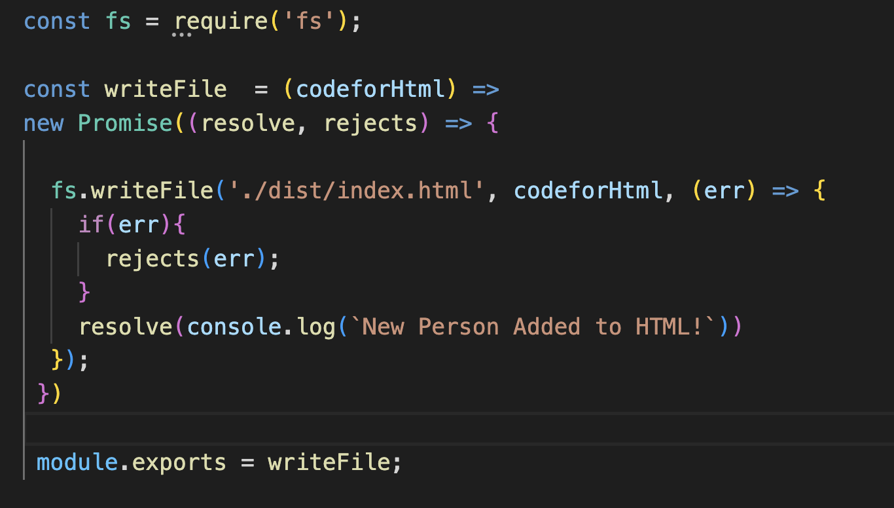

# Team Maker Generator 
   

git repo : https://github.com/JimmySolis/TeamMakerGenerator

  ## Description
  In this project I have the task of creating a program that runs through node to generate an Html page that is filled with information about a team of develpoers. The application prompts the user with specific questions to provide the nessesary information to then relay it in divs to be viewable in the dynamically generated Html.

  ## Table of Contents 
  - [Installation](#installation)
  - [Usage](#usage)
  - [Credits](#credits)

  ## Installation
  Download the files and then all the nesseasry dependencies. Make sure that you run the correct node, jest and inquires versions so that they can be compatible. If you use one to new there may be problems.

  ## Usage
  To use the program make sure you have downloaded all of the dependencies and then simply : node index.js will get the promped questions started. Go through all the questions and then cheack the generated HTML. Feel free to update any information you like once the HTML is made.

  ## Credits
  I want to thank my friend Richard Tran. I relied here and there on checking how somethings were writen to make sure things panned out nicely and at the end they did.

  ## Tests
  In the test folder you will find the test needed to make sure the classes produce the needed personel.

  
  ## Questions
  Here is my email for questions:  Jimmysolis14@gmail.com
   
  If you would like to look me up in github, here is my username: JimmySolis
   
  Follow these instructions to contact me:  
  Please email me with any question. I usally get back in a day.

  ## Walk Through:

  ### 1) First I add all the the needed requirements to run the app.

  ### 2) These are just a few questions I used to prompt with inquier.

  ### 3) This is how I get the next set of prompt questino and also how I end my inquisition.

  ### 4) In this code I am able to send the collected data to where it needs to be.

  ### 5) Here we have the actual lay out being presented.

  ### 6) This is what I will send over to the page that I want to inscribe to.

  ### 7) This function wrtie the code to make the Html.

  ### 8) Final Result.

## Video:

Click link for video:
(https://drive.google.com/file/d/181XWz8sKEJ9lx4CcYiZm9jyhuVAvE74k/view?usp=sharing)

